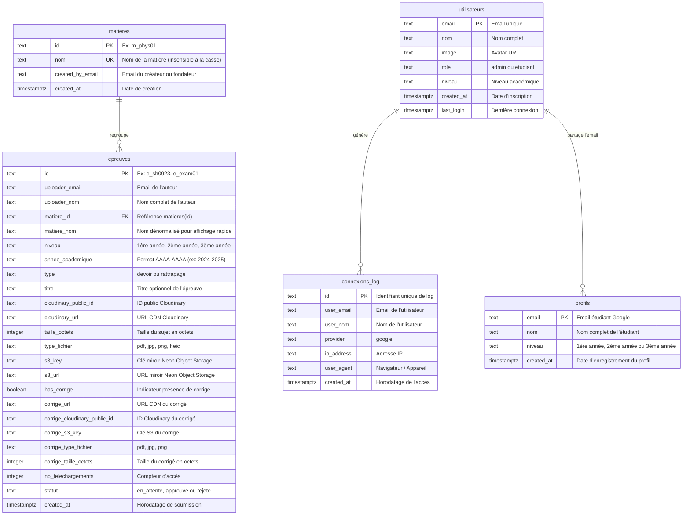

# Modèle de Données & Schéma SQL — Annale229-MBH

Ce document décrit le schéma relationnel, les index de recherche, les données réelles insérées et les typages TypeScript utilisés sur la base **Neon PostgreSQL** de production (`proud-lake-48133023`).

---

## 1. Schéma Relationnel PostgreSQL

Le schéma est défini dans `lib/db/schema.sql` et complété par `lib/db/schema-init.ts`.



---

## 2. Définition SQL Complète des Tables

```sql
-- 1. Table des matières MBH
CREATE TABLE IF NOT EXISTS matieres (
  id               TEXT        PRIMARY KEY,
  nom              TEXT        NOT NULL,
  created_by_email TEXT        NOT NULL,
  created_at       TIMESTAMPTZ NOT NULL DEFAULT NOW()
);

CREATE UNIQUE INDEX IF NOT EXISTS idx_matieres_nom_lower
  ON matieres (LOWER(nom));

-- 2. Table des épreuves avec support des corrigés et miroir S3
CREATE TABLE IF NOT EXISTS epreuves (
  id                           TEXT        PRIMARY KEY,
  uploader_email               TEXT        NOT NULL,
  uploader_nom                 TEXT        NOT NULL,
  matiere_id                   TEXT        NOT NULL REFERENCES matieres(id) ON DELETE RESTRICT,
  matiere_nom                  TEXT        NOT NULL,
  niveau                       TEXT        NOT NULL CHECK (niveau IN ('1ère année', '2ème année', '3ème année')),
  annee_academique             TEXT        NOT NULL,
  type                         TEXT        NOT NULL CHECK (type IN ('devoir', 'rattrapage')),
  titre                        TEXT,
  cloudinary_public_id         TEXT        NOT NULL,
  cloudinary_url               TEXT        NOT NULL,
  taille_octets                INTEGER     NOT NULL DEFAULT 0,
  type_fichier                 TEXT        NOT NULL,
  s3_key                       TEXT,
  s3_url                       TEXT,
  has_corrige                  BOOLEAN     NOT NULL DEFAULT FALSE,
  corrige_url                  TEXT,
  corrige_cloudinary_public_id TEXT,
  corrige_s3_key               TEXT,
  corrige_type_fichier         TEXT,
  corrige_taille_octets        INTEGER     NOT NULL DEFAULT 0,
  nb_telechargements           INTEGER     NOT NULL DEFAULT 0,
  statut                       TEXT        NOT NULL DEFAULT 'approuve' CHECK (statut IN ('en_attente', 'approuve', 'rejete')),
  created_at                   TIMESTAMPTZ NOT NULL DEFAULT NOW()
);

-- 3. Table des profils étudiants (Onboarding & Niveau par défaut)
CREATE TABLE IF NOT EXISTS profils (
  email      TEXT        PRIMARY KEY,
  nom        TEXT        NOT NULL,
  niveau     TEXT        NOT NULL CHECK (niveau IN ('1ère année', '2ème année', '3ème année')),
  created_at TIMESTAMPTZ NOT NULL DEFAULT NOW()
);

-- 4. Table des utilisateurs & rôles applicatifs
CREATE TABLE IF NOT EXISTS utilisateurs (
  email      TEXT        PRIMARY KEY,
  nom        TEXT        NOT NULL,
  image      TEXT,
  role       TEXT        NOT NULL DEFAULT 'etudiant' CHECK (role IN ('admin', 'etudiant')),
  niveau     TEXT,
  created_at TIMESTAMPTZ NOT NULL DEFAULT NOW(),
  last_login TIMESTAMPTZ NOT NULL DEFAULT NOW()
);

-- 5. Table des historiques de connexion
CREATE TABLE IF NOT EXISTS connexions_log (
  id         TEXT        PRIMARY KEY,
  user_email TEXT        NOT NULL,
  user_nom   TEXT,
  provider   TEXT        NOT NULL DEFAULT 'google',
  ip_address TEXT,
  user_agent TEXT,
  created_at TIMESTAMPTZ NOT NULL DEFAULT NOW()
);
```

---

## 3. Index & Recherche Textuelle Optimisée

```sql
-- Index B-Tree pour les filtres rapides du catalogue
CREATE INDEX IF NOT EXISTS idx_epreuves_matiere_id   ON epreuves (matiere_id);
CREATE INDEX IF NOT EXISTS idx_epreuves_niveau        ON epreuves (niveau);
CREATE INDEX IF NOT EXISTS idx_epreuves_annee         ON epreuves (annee_academique);
CREATE INDEX IF NOT EXISTS idx_epreuves_type          ON epreuves (type);
CREATE INDEX IF NOT EXISTS idx_epreuves_has_corrige   ON epreuves (has_corrige);
CREATE INDEX IF NOT EXISTS idx_epreuves_uploader      ON epreuves (uploader_email);
CREATE INDEX IF NOT EXISTS idx_epreuves_statut        ON epreuves (statut);
CREATE INDEX IF NOT EXISTS idx_epreuves_created_at    ON epreuves (created_at DESC);

-- Index GIN plein texte (dictionnaire français) pour recherche instantanée
CREATE INDEX IF NOT EXISTS idx_epreuves_matiere_nom_search 
  ON epreuves USING gin(to_tsvector('french', matiere_nom));

CREATE INDEX IF NOT EXISTS idx_epreuves_titre_search 
  ON epreuves USING gin(to_tsvector('french', COALESCE(titre, '')));
```

---

## 4. Typages TypeScript (`types/index.ts`)

```typescript
export type TypeEpreuve = 'devoir' | 'rattrapage';

export type StatutEpreuve = 'en_attente' | 'approuve' | 'rejete';

export type TypeFichier = 'pdf' | 'jpg' | 'png' | 'heic';

export type NiveauOption = 
  | '1ère année'
  | '2ème année'
  | '3ème année';

export interface Matiere {
  id: string; // m_ + 6 alphanum
  nom: string;
  created_by_email: string;
  created_at: string;
}

export interface Epreuve {
  id: string; // e_ + 6 alphanum
  uploader_email: string;
  uploader_nom: string;
  matiere_id: string;
  matiere_nom: string;
  niveau: string;
  annee_academique: string; // AAAA-AAAA
  type: TypeEpreuve;
  titre?: string;
  cloudinary_public_id: string;
  cloudinary_url: string;
  taille_octets: number;
  type_fichier: TypeFichier;
  nb_telechargements: number;
  statut: StatutEpreuve;
  created_at: string;
  // Neon Object Storage (miroir S3)
  s3_key?: string;
  s3_url?: string;
  // Corrigé & Barème
  has_corrige?: boolean;
  corrige_url?: string;
  corrige_cloudinary_public_id?: string;
  corrige_s3_key?: string;
  corrige_type_fichier?: TypeFichier;
  corrige_taille_octets?: number;
  telechargements_count?: number;
}

export interface Profil {
  email: string;
  nom: string;
  niveau: string;
  created_at: string;
}

// Paramètres de filtrage & pagination stricte
export interface EpreuvesFilterParams {
  niveau?: string;
  matiere?: string | string[];
  annee?: string;
  type?: string;
  q?: string;
  page?: number;
  limit?: number;
  uploader_email?: string;
  statut?: StatutEpreuve | 'all';
}

// Réponse paginée de l'API /api/epreuves
export interface EpreuvesListResponse {
  epreuves: Epreuve[];
  total: number;
  page: number;
  totalPages: number;
  limit: number;
}
```

---

## 5. Données Réelles Insérées & Identifiants Actifs

### Les 8 Matières Fondamentales MBH :
```sql
INSERT INTO matieres (id, nom, created_by_email) VALUES
  ('m_phys01', 'Physique Médicale', 'ulrrichmagbonde@gmail.com'),
  ('m_elec02', 'Électronique Médicale', 'ulrrichmagbonde@gmail.com'),
  ('m_imag03', 'Imagerie Médicale & Radiologie', 'ulrrichmagbonde@gmail.com'),
  ('m_maint04', 'Maintenance des Équipements Hospitaliers', 'ulrrichmagbonde@gmail.com'),
  ('m_anat05', 'Anatomie & Physiologie Humaine', 'ulrrichmagbonde@gmail.com'),
  ('m_secu06', 'Sécurité & Normes Hospitalières', 'ulrrichmagbonde@gmail.com'),
  ('m_inst07', 'Instrumentation Biomédicale', 'ulrrichmagbonde@gmail.com'),
  ('m_tele08', 'Télémédecine & Systèmes d''Information', 'ulrrichmagbonde@gmail.com')
ON CONFLICT (id) DO NOTHING;
```
