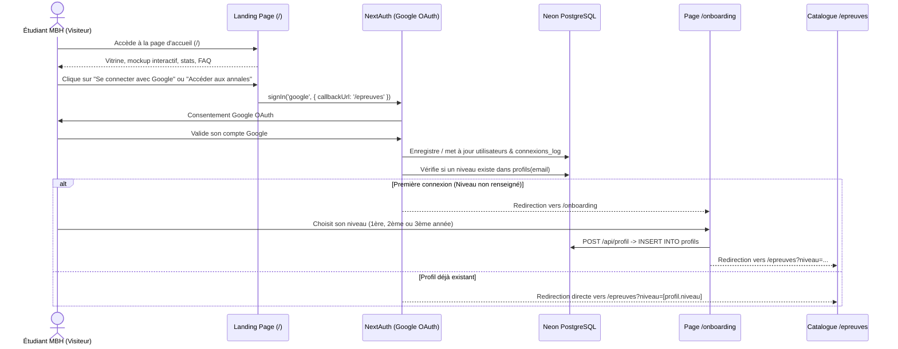
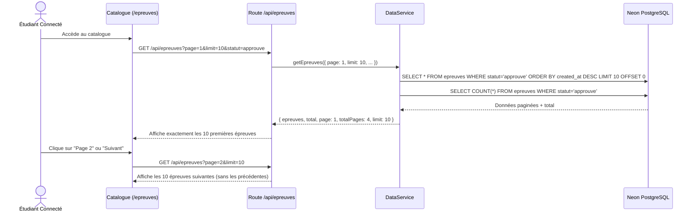
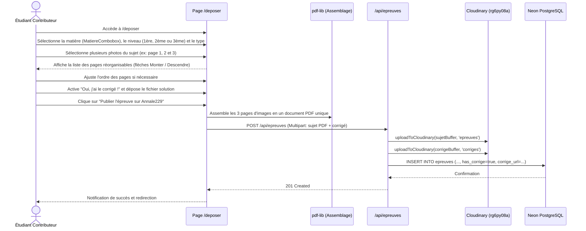

# Parcours Utilisateurs (User Flows) — Annale229-MBH

Ce document détaille les scénarios d'utilisation, les interactions entre composants et les flux de données réels sur la plateforme **Annale229-MBH**.

---

## 🧭 Matrice des Droits & Rôles

| Fonctionnalité | Visiteur Non Connecté | Étudiant Connecté (L1-L3) | Administrateur (`ulrrichmagbonde@gmail.com`) |
|---|:---:|:---:|:---:|
| Découverte de la Landing Page (`/`) | ✅ | ✅ | ✅ |
| Bascule Thème Clair / Sombre | ✅ | ✅ | ✅ |
| Connexion Google OAuth 2.0 | ✅ | ✅ | ✅ |
| Onboarding & Mémorisation du niveau (`/onboarding`) | ❌ (Exige session) | ✅ (À l'inscription) | ✅ |
| Consultation du Catalogue `/epreuves` | ❌ (Redirigé vers `/`) | ✅ | ✅ |
| Pagination stricte (10 épreuves par page) | ❌ | ✅ | ✅ |
| Visionneuse native (Sujet & Corrigé) | ❌ | ✅ | ✅ |
| Partage mobile natif (`navigator.share`) | ❌ | ✅ | ✅ |
| Téléchargement épreuve / Pack ZIP | ❌ | ✅ | ✅ |
| Déposer une épreuve multi-pages (`/deposer`) | ❌ | ✅ | ✅ |
| Suivre & supprimer ses dépôts (`/mes-depots`) | ❌ | ✅ | ✅ |
| Console d'administration & modération (`/admin`) | ❌ | ❌ | ✅ |
| Téléversement en lot (`BulkUploadManager`) | ❌ | ❌ | ✅ |

---

## 📌 Parcours 1 : Découverte & Authentification Google



---

## 📌 Parcours 2 : Onboarding & Mémorisation du Niveau (`/onboarding`)

1. **Déclenchement automatique** : Si l'utilisateur connecté n'a pas encore de niveau dans la table `profils`, il est orienté vers `/onboarding`.
2. **Interface tactile optimisée** :
   - Sélection parmi les 3 niveaux : **1ère année**, **2ème année**, ou **3ème année** MBH.
3. **Persistance synchrone** :
   - Requête `POST /api/profil` enregistrant le choix dans Neon.
   - Redirection immédiate vers le catalogue pré-filtré avec le niveau choisi.
   - Ce choix évite d'avoir à re-sélectionner son niveau lors des visites ultérieures.

---

## 📌 Parcours 3 : Consultation du Catalogue & Pagination Stricte (`/epreuves`)



---

## 📌 Parcours 4 : Consultation d'un Document, Visionneuse & Partage Mobile (`/epreuves/[id]`)

1. **Visionneuse Native Haute Performance** :
   - Chargement direct et net des PDF et images (PNG, JPG, HEIC, WebP).
   - Outils de barre supérieure : Zoom avant, Zoom arrière, réinitialisation (100%), bascule plein écran.
2. **Double Onglet Sujet & Corrigé** :
   - Clic sur l'onglet **Sujet** $\rightarrow$ affichage de l'épreuve.
   - Clic sur l'onglet **Corrigé** $\rightarrow$ affichage de la solution / barème officiel.
   - Si aucun corrigé n'existe, bouton d'ouverture de la modale "Déposer un corrigé".
3. **Téléchargement Sécurisé** :
   - Bouton de téléchargement unifié : si un corrigé est présent, `pdf-lib` fusionne automatiquement le sujet et le corrigé en un unique fichier PDF.
4. **Partage Mobile Natif (`Web Share API`)** :
   - L'étudiant clique sur **"Partager ce sujet"**.
   - Sur smartphone, ouverture de la feuille de partage native du téléphone (permettant d'envoyer directement le lien vers une conversation WhatsApp, un groupe Telegram, ou par email).
   - Sur desktop, copie instantanée du lien dans le presse-papier avec notification toast.

---

## 📌 Parcours 5 : Dépôt Collaboratif Multi-pages & Corrigé (`/deposer`)



---

## 📌 Parcours 6 : Espace Personnel Contributeur (`/mes-depots`)

1. L'étudiant connecté ouvre `/mes-depots` depuis le menu de profil.
2. Le tableau de bord affiche :
   - Le total de ses dépôts et son badge contributeur.
   - Pour chaque épreuve : titre, matière, niveau, année, et badge d'état de modération (*En ligne*, *En attente de validation*, *Non retenue*).
   - Bouton **Consulter** vers la page de l'épreuve.
   - Bouton **Supprimer** ouvrant la modale de confirmation `ConfirmModal` pour retirer définitivement le sujet de la base et du stockage cloud.

---

## 📌 Parcours 7 : Console d'Administration & Modération Groupée (`/admin`)

Réservé exclusivement à `ulrrichmagbonde@gmail.com` :

```mermaid
graph TD
    Admin([Ulrich Magbonde - Admin]) --> Access[/admin]
    Access --> CheckAdmin{Session Admin ?}
    CheckAdmin -->|Non| 403[Accès Refusé]
    CheckAdmin -->|Oui| Panel[Tableau de Bord /admin]

    subgraph "Opérations Administratives"
        Panel --> TabModeration[1. Modération des Épreuves]
        Panel --> TabBulk[2. Import Massif - BulkUploadManager]
        Panel --> TabMatieres[3. Gestion des Matières MBH]
        Panel --> TabAudits[4. Journal des Connexions]
    end

    TabModeration --> MultiSelect{Sélection Multiple}
    MultiSelect -->|Valider le lot| ApproveAll[UPDATE epreuves SET statut='approuve']
    MultiSelect -->|Supprimer le lot| DeleteAll[DELETE FROM epreuves + Nettoyage Cloudinary & S3]
    MultiSelect -->|Pack ZIP de la sélection| ZipExport[POST /api/epreuves/zip]

    TabBulk --> BatchQueue[File d'attente intelligente & Envoi séquentiel]
    TabMatieres --> CrudMatieres[Ajout / Édition / Suppression de cours MBH]
```

---

## 📌 Parcours 8 : Bascule Thème Clair / Thème Sombre

1. L'utilisateur (visiteur ou connecté) clique sur le bouton `ThemeToggle` dans le header ou le menu de profil.
2. Le thème bascule instantanément :
   - Mode Clair $\rightarrow$ Mode Sombre (classe `.dark` ajoutée à `<html>`).
   - Mode Sombre $\rightarrow$ Mode Clair (classe `.dark` retirée de `<html>`).
3. La valeur (`'light'` ou `'dark'`) est enregistrée de manière synchrone dans `localStorage.getItem('annale229-theme')`.
4. Tous les composants, cartes, visionneuse et arrière-plans adaptent leurs contrastes sans scintillement ni rechargement.
